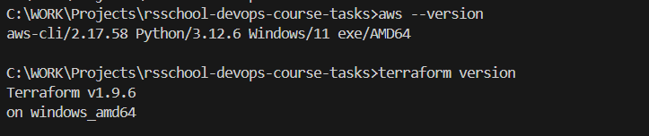
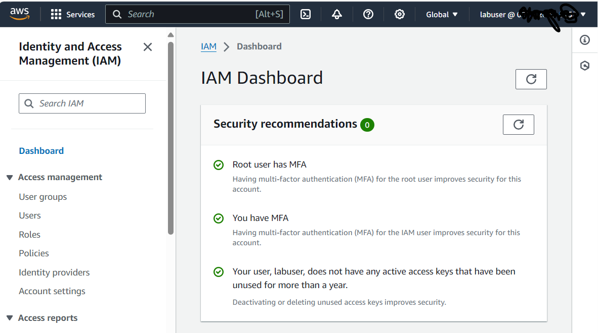

## Submission

Ensure that the AWS CLI and Terraform installations are verified using `aws --version` and `terraform version`.

## Evaluation Criteria (100 points for covering all criteria)

1. **MFA User configured (10 points)**

   - Provide a screenshot of the non-root account secured by MFA (ensure sensitive information is not shared).

   

2. **Bucket and GithubActionsRole IAM role configured (30 points)**

   - Terraform code is created and includes:
     - A bucket for Terraform states
       - https://github.com/CiscoSA/rsschool-devops-course-tasks/blob/task_1/s3.tf
     - IAM role with correct Identity-based and Trust policies
       - https://github.com/CiscoSA/rsschool-devops-course-tasks/blob/task_1/iam.tf

3. **Github Actions workflow is created (30 points)**

   - Workflow includes all jobs
   https://github.com/CiscoSA/rsschool-devops-course-tasks/blob/task_1/.github/workflows/deploy.yml

4. **Code Organization (10 points)**

   - Variables are defined in a separate variables file.
     - https://github.com/CiscoSA/rsschool-devops-course-tasks/blob/task_1/variables.tf
   - Resources are separated into different files for better organization.
     - https://github.com/CiscoSA/rsschool-devops-course-tasks/blob/task_1/s3.tf
     - https://github.com/CiscoSA/rsschool-devops-course-tasks/blob/task_1/iam.tf

5. **Verification (10 points)**

   - Terraform plan is executed successfully for `GithubActionsRole`
     - https://github.com/CiscoSA/rsschool-devops-course-tasks/actions
   - Terraform plan is executed successfully for a terraform state bucket
     - https://github.com/CiscoSA/rsschool-devops-course-tasks/actions

6. **Additional Tasks (10 points)**
   - **Documentation (5 points)**
     - Document the infrastructure setup and usage in a README file.
   - **Submission (5 points)**
   - A GitHub Actions (GHA) pipeline is passing
     - https://github.com/CiscoSA/rsschool-devops-course-tasks/actions
     