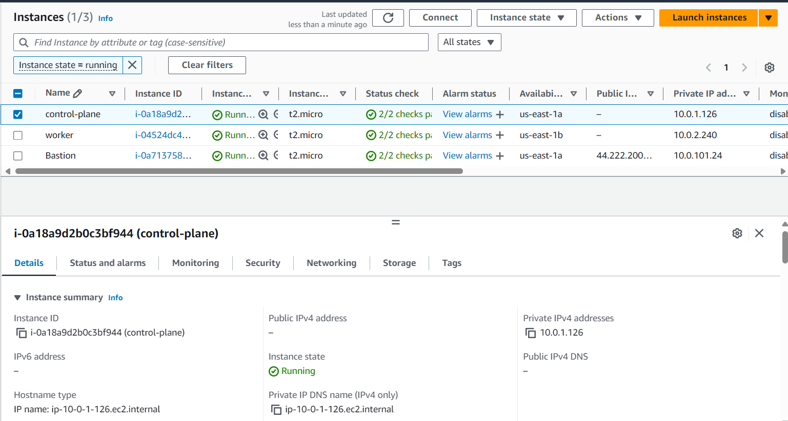

# Task 2: Basic Infrastructure Configuration

## Evaluation Criteria (100 points for covering all criteria)

1. **Terraform Code Implementation (50 points)**

   - Terraform code is created to configure the following:
     - VPC
       - https://github.com/CiscoSA/rsschool-devops-course-tasks/blob/task_2/vpc.tf
     - 2 public subnets in different AZs
       - https://github.com/CiscoSA/rsschool-devops-course-tasks/blob/task_2/subnets.tf
     - 2 private subnets in different AZs
       - https://github.com/CiscoSA/rsschool-devops-course-tasks/blob/task_2/subnets.tf
     - Internet Gateway
       - https://github.com/CiscoSA/rsschool-devops-course-tasks/blob/task_2/igw.tf
     - Routing configuration:
       - Instances in all subnets can reach each other
         - https://github.com/CiscoSA/rsschool-devops-course-tasks/blob/task_2/ec2.tf
         - https://github.com/CiscoSA/rsschool-devops-course-tasks/blob/task_2/ec2-bastion.tf
       - Instances in public subnets can reach addresses outside VPC and vice-versa
       

       

       

       

2. **Code Organization (10 points)**

   - Variables are defined in a separate variables file.
     - https://github.com/CiscoSA/rsschool-devops-course-tasks/blob/task_2/variables.tf
   - Resources are separated into different files for better organization.
     - https://github.com/CiscoSA/rsschool-devops-course-tasks/tree/task_2

3. **Verification (10 points)**

   - Terraform plan is executed successfully.

   

   - A resource map screenshot is provided (VPC -> Your VPCs -> your_VPC_name -> Resource map).

   

4. **Additional Tasks (30 points)**
   - **Security Groups and Network ACLs (5 points)**
     - Implement security groups and network ACLs for the VPC and subnets.
       - https://github.com/CiscoSA/rsschool-devops-course-tasks/blob/task_2/sg.tf
       - https://github.com/CiscoSA/rsschool-devops-course-tasks/blob/task_2/network_acl.tf
   - **Bastion Host (5 points)**
     - Create a bastion host for secure access to the private subnets.
       - https://github.com/CiscoSA/rsschool-devops-course-tasks/blob/task_2/ec2-bastion.tf
   - **NAT is implemented for private subnets (10 points)**
     - Orginize NAT for private subnets with simpler or cheaper way
       - https://github.com/CiscoSA/rsschool-devops-course-tasks/blob/task_2/natgw.tf
     - Instances in private subnets should be able to reach addresses outside VPC
   - **Documentation (5 points)**
     - Document the infrastructure setup and usage in a README file.
       - https://github.com/CiscoSA/rsschool-devops-course-tasks/blob/task_2/README.md
   - **Submission (5 points)**
   - A GitHub Actions (GHA) pipeline is set up for the Terraform code.
     - https://github.com/CiscoSA/rsschool-devops-course-tasks/blob/task_2/.github/workflows/deploy.yml
     